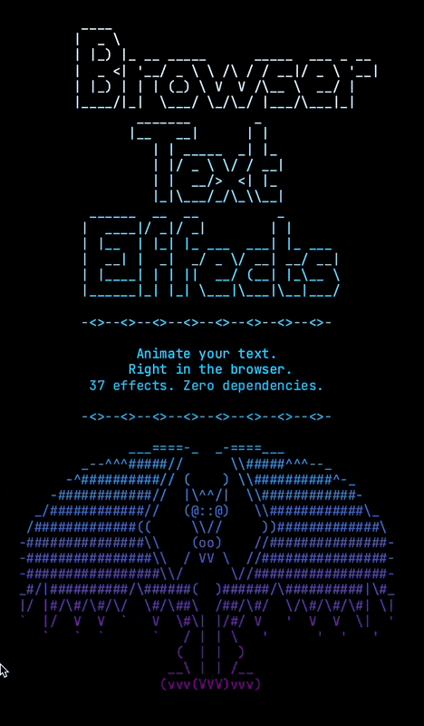

# BrowserTextEffects

37 animated text effects for the browser. Decrypt, matrix, burn, fireworks, rain, and more.

[Live Demo (Effect Showroom)](https://donlair.github.io/browsertexteffects/showroom.html) | [NPM](https://www.npmjs.com/package/browsertexteffects)



## Install

```bash
npm install browsertexteffects
```

## Usage

```html
<div id="target"></div>
```

```js
import { createDecryptEffect } from "browsertexteffects/effects/decrypt";

const handle = createDecryptEffect(document.getElementById("target"), "Hello, world!");

handle.start();
```

To trigger an effect when the element scrolls into view:

```js
import { createMatrixEffectOnScroll } from "browsertexteffects/effects/matrix";

createMatrixEffectOnScroll(document.getElementById("target"), "Hello, world!");
```

### Configuration

Every effect accepts an optional config object:

```js
import { createDecryptEffect, defaultDecryptConfig } from "browsertexteffects/effects/decrypt";

const handle = createDecryptEffect(container, text, {
  ...defaultDecryptConfig,
  typingSpeed: 4,
  onComplete: () => console.log("done"),
});
```

For advanced composition, the root package exports generic core helpers:

```js
import { createEffectWith } from "browsertexteffects";
import { defaultSlideConfig, slideEffect } from "browsertexteffects/effects/slide";

const handle = createEffectWith(container, text, slideEffect, {
  ...defaultSlideConfig,
  grouping: "column",
  reverseDirection: true,
});
```

## Effects

| Effect | Description |
|--------|-------------|
| `beams` | Light beams sweep across text |
| `binarypath` | Binary digits trace paths to form text |
| `blackhole` | Characters spiral into a black hole |
| `bouncyballs` | Characters bounce into position |
| `bubbles` | Text rises into place like bubbles |
| `burn` | Text burns away or into place |
| `colorshift` | Colors shift across the text |
| `crumble` | Text crumbles apart or together |
| `decrypt` | Text decrypts character by character |
| `errorcorrect` | Simulates error correction on text |
| `expand` | Text expands outward from center |
| `fireworks` | Characters burst like fireworks |
| `highlight` | Highlight sweeps across text |
| `laseretch` | Laser etches text into place |
| `matrix` | Matrix-style falling characters |
| `middleout` | Text reveals from the middle outward |
| `orbittingvolley` | Characters orbit before landing |
| `overflow` | Text overflows into position |
| `pour` | Characters pour in from above |
| `print` | Typewriter-style printing |
| `rain` | Characters rain down the screen |
| `randomsequence` | Characters appear in random order |
| `rings` | Ring patterns reveal text |
| `scattered` | Characters scatter and reassemble |
| `slice` | Text slices into view |
| `slide` | Text slides in from a direction |
| `smoke` | Smoky text reveal |
| `spotlights` | Spotlights illuminate text |
| `spray` | Characters spray into place |
| `swarm` | Characters swarm into position |
| `sweep` | A sweep reveals the text |
| `synthgrid` | Synth-wave grid effect |
| `thunderstorm` | Lightning-flash text reveal |
| `unstable` | Text jitters and stabilizes |
| `vhstape` | VHS tape distortion effect |
| `waves` | Wave motion across the text |
| `wipe` | Text wipes on from an edge |

## API

### `createEffectWith(container, text, effectDefinition, config?)`

Creates an effect from an imported `effectDefinition` and returns an `EffectHandle` with `start()` and `stop()` methods.

### `createEffectOnScrollWith(container, text, effectDefinition, config?)`

Same as `createEffectWith`, but automatically starts when the container scrolls into view.

### `browsertexteffects/effects/*`

Each effect has its own tree-shakable subpath, for example:

- `browsertexteffects/effects/decrypt`
- `browsertexteffects/effects/matrix`
- `browsertexteffects/effects/slide`

Each subpath exports:

- `create*Effect(...)`
- `create*EffectOnScroll(...)`
- `*Effect` descriptor for `createEffectWith(...)`
- `default*Config`
- the effect config type and class

## Credits

TypeScript port of [TerminalTextEffects](https://github.com/ChrisBuilds/terminaltexteffects) by [ChrisBuilds](https://github.com/ChrisBuilds), adapted for the browser.

## License

MIT
